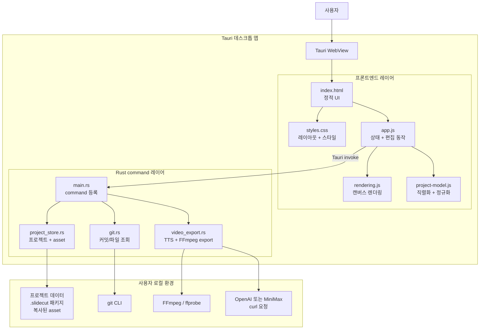
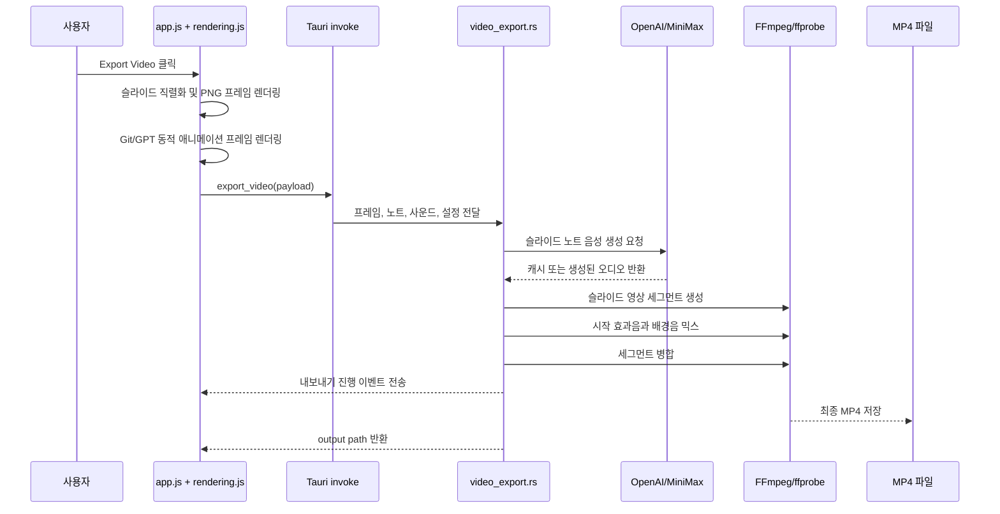

# Slide Cut


[](https://github.com/hypulse/slide-cut/releases/latest)
[](https://github.com/hypulse/slide-cut/stargazers)
[](https://github.com/hypulse/slide-cut/releases/latest)

[English](README.md) | [한국어](README.ko.md)

Slide Cut은 생각을 빠르게 영상으로 만드는 도구입니다.

## 어떤 앱인가요?

Slide Cut은 무거운 프레젠테이션 도구나 복잡한 영상 편집기를 열지 않고도, 빠르게 무언가를 설명해야 하는 사람을 위한 도구입니다.

이런 작업에 사용할 수 있습니다.

- 제품 소개와 짧은 피치 슬라이드
- 유튜브 또는 숏폼 영상용 설명 장면
- Git 커밋 기반 코드 변경 설명
- GPT 대화 스타일 슬라이드
- 문서, 썸네일, 소셜 포스트용 PNG 이미지
- 슬라이드 노트를 읽어주는 MP4 영상

앱의 방향은 작고 명확합니다. 시각 요소를 배치하고, 설명 노트를 쓰고, 바로 쓸 수 있는 결과물을 내보내는 데 집중합니다.

## 주요 기능

- 여러 장의 슬라이드, 썸네일, 순서 변경, 복제, 자동 저장
- 클립보드 이미지 바로 붙여넣기
- 텍스트 상자, 선, 화살표, 펜 오브젝트 추가
- 오브젝트 이동, 크기 조절, 회전, 정렬, 복제, 레이어 순서 조정
- 단일 슬라이드 PNG 내보내기
- 전체 슬라이드 MP4 내보내기
- OpenAI 또는 MiniMax TTS로 슬라이드 노트 음성 생성
- OpenAI로 일반 슬라이드의 텍스트 상자와 슬라이드 노트 번역
- 선택적 자막을 영상에 직접 삽입
- 슬라이드별 시작 효과음과 프로젝트 배경음 추가
- 선택한 저장소, 커밋, 파일에서 Git 타이핑 슬라이드 생성
- GPT 대화 타이핑 슬라이드 생성
- asset이 포함된 `.slidecut` 프로젝트 패키지 저장/가져오기

## 향후 개발 계획

앞으로 개선할 주요 방향입니다.

- [x] 편집 화면과 자주 쓰는 작업 흐름을 더 자연스럽게 다듬기
- [ ] 세로형 쇼츠 영상에 맞는 캔버스 프리셋과 내보내기 옵션 추가
- [ ] 글꼴, 굵기, 텍스트 스타일을 고를 수 있는 폰트 편집 기능 추가
- [ ] Git 슬라이드와 GPT 대화 슬라이드에 사용자 지정 스타일 적용
- [ ] AI가 Slide Cut 프로젝트를 만들고 조회하고 내보낼 수 있도록 MCP 인터페이스 제공
- [ ] 발표 현장에서 바로 사용할 수 있는 프레젠테이션 기능 확장
- [ ] 텍스트, 이미지, 도형, 강조 요소에 개별 애니메이션 추가
- [ ] 내보내기 기능에 외부 도구나 선택 패키지가 필요할 때 명확한 설치 안내 제공

## 설치

GitHub Releases에 배포 파일이 올라오면 최신 macOS ZIP을 내려받습니다.

압축을 풀고 `Slide Cut.app`을 실행한 뒤 Projects 창에서 새 프로젝트를 시작합니다.

앱이 서명되지 않았다는 이유로 macOS가 실행을 막는 경우 Finder에서 우클릭 -> 열기로 실행합니다. 로컬 또는 초기 오픈소스 빌드에서는 자연스러운 동작입니다.

## 기본 사용 흐름

1. 이미지를 붙여넣거나 텍스트를 추가합니다.
2. 캔버스 위에서 오브젝트를 배치합니다.
3. 슬라이드 목록에서 새 슬라이드를 추가합니다.
4. 내레이션이 필요하면 슬라이드 노트를 작성합니다.
5. 필요한 경우 효과음, 배경음, Git/GPT 동적 슬라이드를 추가합니다.
6. PNG 또는 MP4로 내보냅니다.
7. 나중에 이어서 편집하려면 `.slidecut` 프로젝트 패키지로 내보냅니다.

## 영상 내보내기 참고

MP4 내보내기는 FFmpeg와 ffprobe를 사용합니다. 두 도구가 사용자의 컴퓨터에 설치되어 있어야 합니다.

내레이션 영상과 슬라이드 번역을 사용하려면 Settings에서 API Key를 입력합니다.

- OpenAI: 슬라이드 번역, `gpt-4o-mini-tts`, `tts-1`, `tts-1-hd`
- MiniMax: 지원되는 MiniMax 음성 모델과 보이스

캔버스 크기, 내레이션 기본값, 자막 설정, 내보내기 폴더, 배경음은 현재 프로젝트 설정으로 저장됩니다.
번역은 슬라이드 목록 하단에서 일반 슬라이드에만 실행할 수 있습니다. 선택한 슬라이드의 텍스트 상자와 노트만 바꾸며, Git 슬라이드와 GPT 대화 슬라이드는 건너뜁니다.

## 로컬 중심 프로젝트

Slide Cut은 데스크톱 앱을 통해 프로젝트를 사용자의 컴퓨터에 저장합니다. 가져온 이미지, 영상, 오디오 asset은 프로젝트 저장소로 복사되므로 원본 파일 위치가 바뀌어도 프로젝트를 계속 사용할 수 있습니다.

`Export Project`를 사용하면 나중에 다시 가져올 수 있는 `.slidecut` 패키지를 만들 수 있습니다.

## 기여자를 위한 정보

### 소스에서 빌드하기

필요한 도구:

- Node.js와 npm
- Rust toolchain
- 영상 내보내기용 FFmpeg와 ffprobe

```bash
npm install
npm run build
```

빌드 결과:

- 릴리스 ZIP: `release/Slide-Cut-v1.1.4-macos-arm64.zip`
- SHA256 체크섬: `release/Slide-Cut-v1.1.4-macos-arm64.zip.sha256`
- macOS 앱 번들: `src-tauri/target/release/bundle/macos/Slide Cut.app`

### 아키텍처



앱은 데스크톱 전용입니다. 프론트엔드는 편집기, 미리보기, PNG 프레임, 동적 슬라이드 애니메이션을 렌더링합니다. Rust는 로컬 프로젝트 저장, asset 복사, Git 조회, TTS 요청, FFmpeg 영상 조립, 내보내기 진행 이벤트를 담당합니다.

### MP4 내보내기 흐름



### 파일 설명

- `index.html`: 정적 데스크톱 UI 구조
- `styles.css`: 앱 레이아웃과 편집기 스타일
- `app.js`: 프론트엔드 상태, DOM 연결, 편집 동작, 내보내기 흐름
- `rendering.js`: 텍스트, Git 동적 슬라이드, 내보내기 프레임용 캔버스 렌더링
- `project-model.js`: 프로젝트 직렬화, 복제, 정규화
- `src-tauri/src/main.rs`: Tauri 시작과 command 등록
- `src-tauri/src/project_store.rs`: 로컬 프로젝트, 설정, asset 복사, `.slidecut` 가져오기/내보내기
- `src-tauri/src/git.rs`: 커밋 목록, 변경 파일 목록, 파일 변경 내용 추출
- `src-tauri/src/video_export.rs`: TTS 생성, FFmpeg 세그먼트 생성, MP4 내보내기, 취소, 진행 이벤트
- `src-tauri/tauri.conf.json`: 앱 메타데이터, 빌드 복사 명령, CSP, 번들 설정
- `src-tauri/icons/`: 임시 앱 아이콘 원본과 생성된 번들 아이콘
- `scripts/package-release.sh`: macOS 앱 ZIP과 SHA256 체크섬 생성

### 개발 검증 명령

```bash
node --check app.js
node --check rendering.js
node --check project-model.js
cargo check --manifest-path src-tauri/Cargo.toml
cargo clippy --manifest-path src-tauri/Cargo.toml --all-targets -- -D warnings
npm run build
```

## 라이선스

[MIT](LICENSE)
