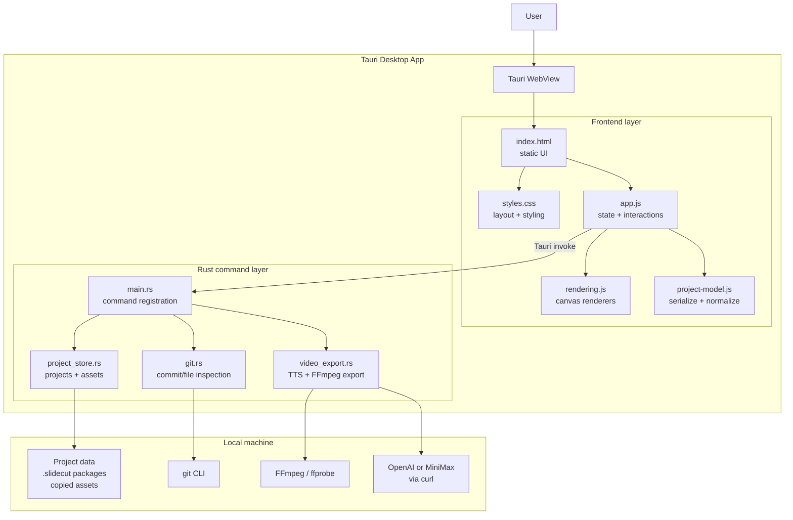
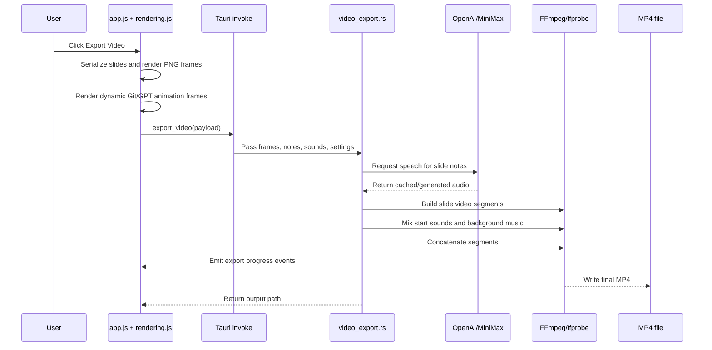

# Slide Cut


[](https://github.com/hypulse/slide-cut/releases/latest)
[](https://github.com/hypulse/slide-cut/stargazers)
[](https://github.com/hypulse/slide-cut/releases/latest)

[English](README.md) | [한국어](README.ko.md)

Slide Cut is a lightweight desktop app for quickly turning thoughts into videos.

## What It Is

Slide Cut is for people who need to explain something quickly without opening a heavy presentation suite or a full video editor.

Use it to make:

- product explainers and quick pitch slides
- YouTube or short-form video scenes
- code-change walkthroughs from a Git commit
- GPT-style conversation slides
- PNG images for docs, thumbnails, and social posts
- narrated MP4 videos from slide notes

The app is intentionally small. It focuses on arranging visual blocks, writing notes, and exporting a useful result.

## Highlights

- Multi-slide projects with thumbnails, ordering, duplication, and autosave
- Paste images directly onto the canvas
- Add text boxes, lines, arrows, and pen marks
- Move, resize, rotate, align, duplicate, and layer objects
- Export a single slide as PNG
- Export a slide deck as MP4
- Generate speech from slide notes with OpenAI or MiniMax TTS
- Translate regular slide text boxes and slide notes with OpenAI
- Burn optional subtitles into exported video
- Add per-slide start sounds and project background music
- Create animated Git slides from a selected repository, commit, and file
- Create animated GPT conversation slides
- Save and import `.slidecut` project packages with assets included

## Roadmap

Planned development areas:

- [x] Refine the editor UI and make common workflows easier to follow
- [ ] Add presets and export options for vertical short-form videos
- [ ] Add font controls for choosing typefaces, weights, and text styles
- [ ] Let Git slides and GPT conversation slides use custom visual styles
- [ ] Provide an MCP interface so AI agents can create, inspect, and export Slide Cut projects
- [ ] Expand Slide Cut so it can also be used for live presentations
- [ ] Add per-object animations for text, images, shapes, and callouts
- [ ] Show clear setup guidance when an export feature needs an external tool or optional package

## Install

Download the latest macOS ZIP from the GitHub Releases page when a release is available.

Unzip it, open `Slide Cut.app`, and start a new project from the Projects window.

If macOS blocks the app because it is unsigned, open it from Finder with right click -> Open. This is expected for local or early open-source builds.

## Basic Workflow

1. Paste an image or add text.
2. Arrange objects on the canvas.
3. Add more slides from the slide list.
4. Write slide notes if you want narration.
5. Choose sounds, background music, or dynamic Git/GPT slides when needed.
6. Export as PNG or MP4.
7. Export a `.slidecut` project package when you want to move the editable project with its assets.

## Video Export Notes

MP4 export uses FFmpeg and ffprobe. They must be available on your machine.

For narrated exports and slide translation, add an API key in Settings:

- OpenAI for slide translation and `gpt-4o-mini-tts`, `tts-1`, or `tts-1-hd`
- MiniMax for supported MiniMax speech models and voices

Canvas size, narration defaults, subtitle settings, export folder, and background music are saved with the current project.
Translation is available from the slide list footer for regular slides. It updates text boxes and slide notes on the selected slide only; Git slides and GPT conversation slides are skipped.

## Local-First Projects

Slide Cut stores projects on your computer through the desktop app. Imported image, video, and audio assets are copied into the project storage so a saved project can keep working even after the original file moves.

Use `Export Project` to create a `.slidecut` package that can be imported later.

## For Contributors

### Build From Source

Requirements:

- Node.js and npm
- Rust toolchain
- FFmpeg and ffprobe for video export

```bash
npm install
npm run build
```

Build output:

- Release ZIP: `release/Slide-Cut-v1.1.3-macos-arm64.zip`
- SHA256 checksum: `release/Slide-Cut-v1.1.3-macos-arm64.zip.sha256`
- macOS app bundle: `src-tauri/target/release/bundle/macos/Slide Cut.app`

### Architecture



The app is desktop-only. The frontend renders the editor, previews, PNG frames, and dynamic slide animations. Rust handles local project storage, asset copying, Git inspection, TTS requests, FFmpeg video assembly, and export progress events.

### MP4 Export Flow



### File Guide

- `index.html`: static desktop UI structure
- `styles.css`: app layout and editor styling
- `app.js`: main frontend state, DOM wiring, editor interactions, export orchestration
- `rendering.js`: canvas rendering helpers for text, dynamic Git slides, and export frames
- `project-model.js`: project serialization, cloning, and normalization
- `src-tauri/src/main.rs`: Tauri startup and command registration
- `src-tauri/src/project_store.rs`: local projects, settings, asset copying, `.slidecut` import/export
- `src-tauri/src/git.rs`: commit list, changed file list, and commit file-change extraction
- `src-tauri/src/video_export.rs`: TTS generation, FFmpeg segment creation, MP4 export, cancellation, progress events
- `src-tauri/tauri.conf.json`: app metadata, build copy command, CSP, bundle settings
- `src-tauri/icons/`: placeholder app icon source and generated bundle icons
- `scripts/package-release.sh`: zips the macOS app and writes the SHA256 checksum

### Development Checks

```bash
node --check app.js
node --check rendering.js
node --check project-model.js
cargo check --manifest-path src-tauri/Cargo.toml
cargo clippy --manifest-path src-tauri/Cargo.toml --all-targets -- -D warnings
npm run build
```

## License

[MIT](LICENSE)
